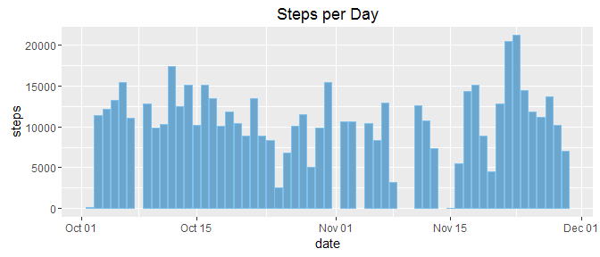
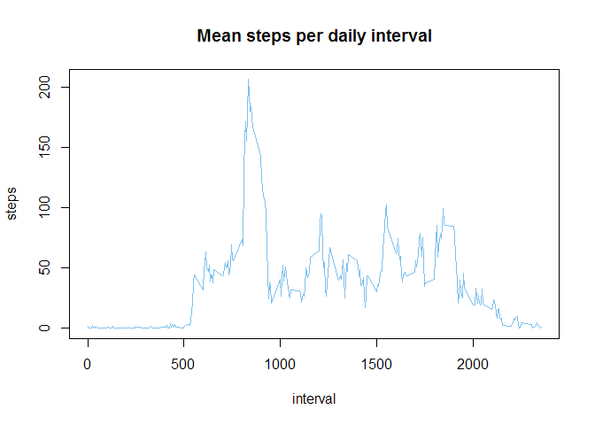
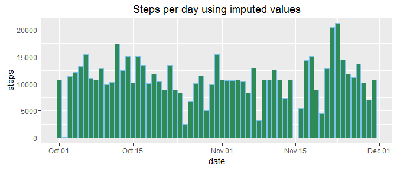
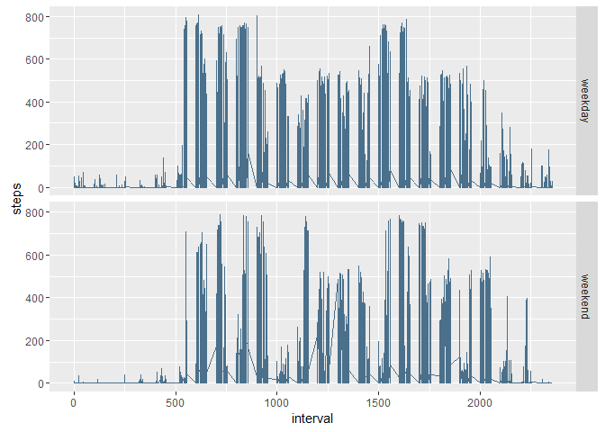

# Reproducible Research - Assignment Week 2
Steve Guttman  
June 12, 2016  
##Introduction
It is now possible to collect a large amount of data about personal movement using activity monitoring devices such as a Fitbit, Nike Fuelband, or Jawbone Up. These type of devices are part of the “quantified self” movement – a group of enthusiasts who take measurements about themselves regularly to improve their health, to find patterns in their behavior, or because they are tech geeks. But these data remain under-utilized both because the raw data are hard to obtain and there is a lack of statistical methods and software for processing and interpreting the data. 

This assignment makes use of data from a personal activity monitoring device. This device collects data at 5 minute intervals through out the day. The data consists of two months of data from an anonymous individual collected during the months of October and November, 2012 and include the number of steps taken in 5 minute intervals each day.


## Loading and preprocessing the data
First, we check to see if the zip file exists locally. If not, it is downloaded. The relevant activity data is extracted directly from the zip file into a data frame. The *summarize* function from the *DPLYR* package is used to aggregate step information from the data table.

```r
## Load dependent libraries
     suppressMessages(library(dplyr))
     library(ggplot2)

## Download the relevant data set if it doesn't exist already
     if( !file.exists("repdata.data-activity.zip")) {
          fileUrl <- "https://d396qusza40orc.cloudfront.net/repdata%2Fdata%2Factivity.zip"
          download.file( fileUrl, destfile = "repdata.data-activity.zip")
          dateDownloaded <- date()
     }
## Extract activity set from the zip file and print head
     activity <- read.csv(unz("repdata.data-activity.zip","activity.csv" ), colClasses = c("integer","Date","integer"))
     results <- activity %>% group_by(date) %>% summarize(steps = sum(steps))
     stepSummary = summary(results$steps)
```

##What is mean total number of steps taken per day? 


```r
     g = ggplot(results, aes(date, steps))
     g + geom_bar(stat="identity", color="skyblue2", fill="skyblue3") + ggtitle("Steps per Day") + theme_gray()
```

<!-- -->

The mean number of total steps per day is **10770** and  
The median number of total steps per day is **10760**  

##What is the average daily activity pattern? 
  

```r
     actPattern <- activity %>% filter(!is.na(steps)) %>% 
          group_by(interval) %>% 
          summarize(steps = mean(steps))
     maxInterval = actPattern[which.max(actPattern$steps),"interval"]
     
     with(actPattern, plot(interval, steps, type = "l", main="Mean steps per daily interval", col="skyblue2"))
```

<!-- -->
  
The 5-minute interval, **#835**, on average across all the days in the dataset, contains the maximum number of steps.

##Imputing missing values

Note that there are a number of days/intervals where there are missing values (coded as NA). The presence of missing days may introduce bias into some calculations or summaries of the data.  
  
There are **2304** missing values in the data set.    

### Strategy for imputing missing values
In order to compute missing values, we will adopt the fairly simple-minded scheme of taking the per-interval average across all days (as computed above) and using that average as the missing value.Note that the data frame *actPattern* contains the tabulation of mean steps for each interval. We will use this to impute missing values.  
  
To do the actual imputing, we split the data frame in two--NAs and no-NAs; join the NA frame with *actPattern* and then bind the two data frames together.


```r
# Create imputed data by breaking NAs out from the rest of the data table, adding in missing values 
#    and then joining 
     actNA = activity %>% 
          filter(is.na(steps)) %>% 
          select(-steps) %>% 
          left_join(actPattern, by = "interval")
     actNoNA = activity %>% 
          filter(!is.na(steps))
     actImputed = bind_rows(actNoNA, actNA)
     
# Create summary data
     results <- actImputed %>% group_by(date) %>% summarize(steps = sum(steps))
     stepSummary = summary(results$steps)
     
# Plot the new data table     
     g = ggplot(results, aes(date, steps))
     g + geom_bar(stat="identity", color="skyblue2", fill="seagreen4") + ggtitle("Steps per day using imputed values") + theme_gray()
```

<!-- -->

The mean number of total steps per day is **10770** and  
The median number of total steps per day is **10770**  

For this example, the mean number of steps per day remained constant and the median steps increased.

##Are there differences in activity patterns between weekdays and weekends?


```r
     actWeek = actImputed %>% mutate(day = as.factor(weekdays(date, abbreviate = TRUE)))
     levels(actWeek$day) = c("weekday", "weekend", "weekend", "weekday", "weekday", "weekday", "weekday")
     
     g = ggplot(actWeek, aes(x=interval, y=steps))
     g + geom_line(color="skyblue4") + facet_grid(day~.)
```

<!-- -->
